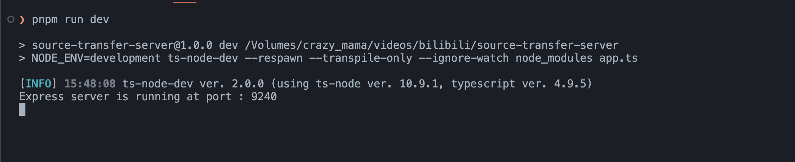

# source-transfer-server

这是一个资源转换器的项目（目前支持转换 B站视频），依赖（`source-transfer-scripts`），这里主要实现了服务端部分的内容

# 功能点

该项目主要负责：
  - 临时存放视频和图片
  - 资源转换接口
  - 前端部分的模板渲染

# 使用步骤
> ## 使用前注意
> 1. 建议 Node 版本大于 14
> 2. 本项目使用 pnpm 管理，建议使用 pnpm 安装项目
> 3. 本项目需要和 `source-transfer-scripts` 同时运行
----

1. 安装依赖，在根目录下执行

```bash
pnpm install;
```

2. 运行项目
```bash
pnpm run dev;
```

3. 运行项目：[链接地址: http://localhost:9240](http://localhost:9240) 

    看到以下画面就算是运行成功了：
    
